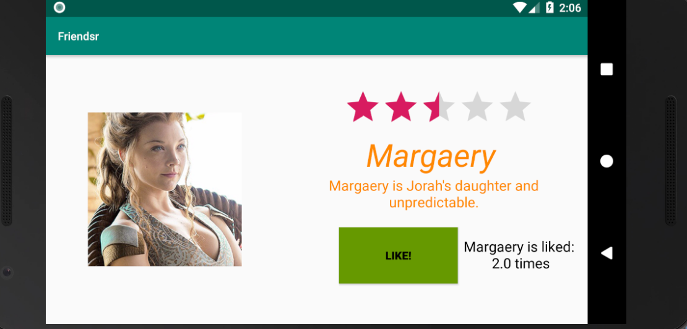

# Friendsr

#### First Screenshot

#### Second Screenshot 
##### I have done extra: Add a Like Button and keep track of 'Amount of Likes'

#### Third Screenshot = Landscape

#### Fourth Screenshot = Landscape

